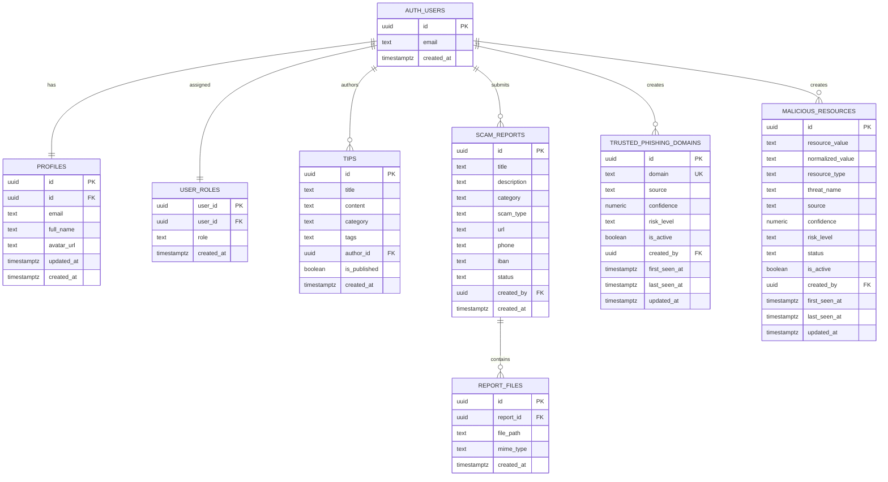

# StaySafeBG

StaySafeBG is a web application for online scam prevention. Users can check suspicious URLs/domains/emails, submit scam reports with evidence files, and read educational safety content (tips). The platform uses Supabase for authentication, database, storage, and edge functions.

## 1) Project Description

### Core Features
- Scam check (`scam-check`) by combining:
   - local approved scam reports,
   - trusted phishing domain intelligence,
   - malicious resources list,
   - external threat sources via Edge Function (`threat-check`).
- Scam report submission (`report-scam`) with optional evidence attachments.
- Public and admin-managed educational content (`tips`).
- Community feed of approved scam reports.

### Roles and Permissions
- **Anonymous user**
   - Can browse public content (published tips, approved reports).
   - Can use scam check.
- **Authenticated user (`user`)**
   - All anonymous permissions.
   - Can create own reports (`pending`).
   - Can access own reports and own evidence files.
- **Moderator (`moderator`)**
   - Can review/manage reports and report status.
   - Can manage tips content.
   - Can manage `trusted_phishing_domains` and `malicious_resources`.
- **Admin (`admin`)**
   - All moderator permissions.
   - Can manage users and roles via RPCs.

## 2) Architecture

### Front-End
- Multi-page app built with **Vite + Vanilla JavaScript + Bootstrap**.
- HTML entry points:
   - `index.html`, `login.html`, `register.html`, `tips.html`, `tips-details.html`, `article-details.html`, `scam-check.html`, `report-scam.html`, `community.html`, `admin.html`.
- Page logic in `src/pages/`, shared UI in `src/components/`.

### Back-End (Supabase)
- **Auth**: sign up, sign in, session handling.
- **Postgres**: business tables, RLS policies, RPC functions.
- **Storage**: `evidence` bucket for report files.
- **Edge Function**: `supabase/functions/threat-check/index.ts` for aggregated threat checks and scoring.

### Technologies
- Front-end: `vite`, `bootstrap`, `@supabase/supabase-js`
- Back-end: Supabase (Postgres, Auth, Storage, Edge Functions)
- Database migrations: `supabase/migrations/*.sql`

## 3) Database Schema Design

### ER Diagram



### Database Schema Details

#### `public.user_roles`
- PK: `user_id` -> `auth.users(id)`
- Purpose: authorization role per user
- Constraint: `role IN ('user', 'admin', 'moderator')`

#### `public.profiles`
- PK/FK: `id` -> `auth.users(id)`
- Purpose: public user profile data

#### `public.tips` *(renamed over time: `articles` -> `news` -> `tips`)*
- PK: `id`
- FK: `author_id` -> `auth.users(id)` (`ON DELETE SET NULL`)
- Purpose: educational content

#### `public.scam_reports`
- PK: `id`
- FK: `created_by` -> `auth.users(id)` (`ON DELETE CASCADE`)
- Key fields: `category`, `scam_type`, `url`, `phone`, `iban`, `status`
- Status check: `status IN ('pending', 'approved', 'rejected')`

#### `public.report_files`
- PK: `id`
- FK: `report_id` -> `public.scam_reports(id)` (`ON DELETE CASCADE`)
- Purpose: metadata for evidence files stored in Supabase Storage

#### `public.trusted_phishing_domains`
- PK: `id`
- Unique: `domain`
- FK: `created_by` -> `auth.users(id)` (`ON DELETE SET NULL`)
- Key fields: `confidence`, `risk_level`, `is_active`
- Risk check: `risk_level IN ('low', 'medium', 'high')`

#### `public.malicious_resources`
- PK: `id`
- Unique composite: `(resource_type, normalized_value)`
- FK: `created_by` -> `auth.users(id)` (`ON DELETE SET NULL`)
- Key fields: `resource_type`, `status`, `confidence`, `risk_level`, `is_active`
- Checks:
   - `resource_type IN ('url', 'domain', 'ip', 'hash', 'file', 'other')`
   - `status IN ('online', 'offline', 'unknown')`
   - `risk_level IN ('low', 'medium', 'high')`

### Security Model (RLS)
- RLS is enabled on core business tables.
- Anonymous users read only public/approved/active data.
- Authenticated users can manage own records where policies allow.
- Moderators/admins have expanded access through policy checks and helper functions (`is_admin`, `is_moderator`, `can_moderate_reports`, `can_manage_news`).

## 4) Local Development Setup Guide

### 1. Prerequisites
- Node.js 18+
- npm
- A Supabase project

### 2. Install dependencies
```bash
npm install
```

### 3. Configure environment variables
Copy `.env.example` to `.env` and set:

```env
VITE_SUPABASE_URL=https://your-project-ref.supabase.co
VITE_SUPABASE_ANON_KEY=your-anon-key
```

### 4. Run locally
```bash
npm run dev
```

### 5. Build and preview
```bash
npm run build
npm run preview
```

### 6. Optional: deploy `threat-check` Edge Function
For best scam-check coverage, deploy:
- Function file: `supabase/functions/threat-check/index.ts`
- Optional function secrets:
   - `GOOGLE_SAFE_BROWSING_API_KEY`
   - `VIRUSTOTAL_API_KEY`

If the edge function is unavailable, the front-end falls back to a basic direct external check.

## 5) Key Folders and Files

### Root
- `index.html`, `login.html`, `register.html`, `tips.html`, `tips-details.html`, `article-details.html`, `scam-check.html`, `report-scam.html`, `community.html`, `admin.html` - page entry points.
- `vite.config.js` - multi-page Vite build configuration.
- `package.json` - scripts and dependencies.

### `src/`
- `src/pages/` - page-level UI logic.
- `src/components/` - reusable UI pieces (`header.js`, `footer.js`).
- `src/services/` - data/auth/business layer:
   - `authService.js`, `rolesService.js`
   - `reportsService.js`, `storageService.js`
   - `tipsService.js`
   - `trustedDomainsService.js`, `maliciousResourcesService.js`
   - `scamCheckService.js`
   - `adminUsersService.js`
   - `supabaseClient.js`
- `src/styles/` - page and global styles.
- `src/utils/notifications.js` - notification helpers.

### `supabase/`
- `supabase/migrations/` - append-only SQL migrations.
- `supabase/functions/threat-check/index.ts` - threat aggregation and risk scoring function.

## 6) Notes for Contributors

- Do not edit already applied migrations; create new migration files for every schema change.
- Keep local migration files and remote migration history in sync.
- Access is enforced through RLS policies and role-based helper functions.
